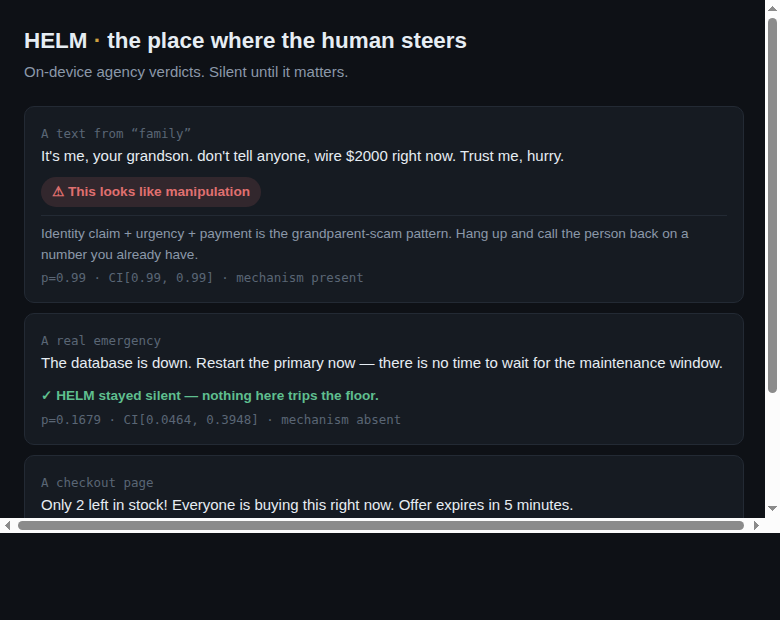

# NOVORA HELM — the personal agency layer (v0.1)

*The helm is the one place on a ship where the human steers.*

HELM runs the IHCEI/NERE probabilistic kernel **entirely on-device**, so every
message, answer, offer, feed item, or agent action can arrive with a calibrated
agency verdict — *does this develop me or steer me?* — at zero marginal cost,
owned by the person, **silent until it matters**. Nothing audited ever leaves
the device: HELM is architecturally incapable of surveillance, not by policy but
by topology (there is no network call in the kernel — a test proves it).

This is v0.1 from the design doc's build sequence: **fast mode + corroboration
gate + the four primitives, all local.** No API key, no server, no account.



## What's here

```
novora-helm/
  helm.html             THE APP. One file. Open it in a browser — that is the
                        whole install. No server, no build step to read it.
  helm_template.html    what helm.html is generated FROM (edit this, not that)
  build_helm.mjs        inlines the kernel; --check asserts the page matches
  src/helm-core.mjs     AUDIT — the on-device kernel (posterior +
                        corroboration gate + consumer-threat lexicon)
  src/primitives.mjs    DELEGATE (decision-permission table) ·
                        DEVELOP (capacity vs. dependency) ·
                        PROVE (hash-chained certificate wallet)
  src/order.mjs         the three layers, the six stages, the ten elements,
                        the six procedures — and what each one refuses
  test/helm.test.mjs    48 assertions — safety, scam armor, gate, 4 primitives
  test/parity.test.mjs  22 assertions — cross-engine gate + lexicon-stamp parity
  test/order.test.mjs   18 assertions — the hierarchy, and whether it refuses
  test/helm-html.test.mjs  25 assertions — the shipped page's four claims
  demo/index.html       renderable local demo (paste anything, see the verdict)
  extension/            MV3 browser-extension scaffold (popup surface, loadable)
  VALIDATION.md         what was tested, the numbers, what HELM does in the world
  PREREGISTRATION.md    LOCKED spec for on-device deep mode + emergency-at-scale
```

## Open it

```sh
npm test                      # 143 assertions across six suites
node build_helm.mjs           # regenerate helm.html from its sources
open novora-helm/helm.html    # or just double-click it
```

Pull the network cable out first if you want to watch the claim hold. There is
no `fetch`, no `XMLHttpRequest`, no `<script src>`, no `<link>`, no `@import`
and no webfont in that file, and `test/helm-html.test.mjs` greps for every one
of them on the shipped bytes.

## The hierarchy the whole thing hangs off

Three layers, each strictly inside the next:

| | Layer | What is there | What HELM does |
|---|---|---|---|
| 1 | **What instruments reach** | Weighable, repeatable, countable. | Measures here, and nowhere else. |
| 2 | **The working order** | What things are, who holds what, what is owed, what follows from crossing a boundary. | Can check an order was *written down*. Cannot check it is right. |
| 3 | **The whole domain** | Everything there is, reached or not. | Measures nothing. Says so. |

This is in `src/order.mjs` rather than in prose because two rules the stack
already enforces are *consequences* of it, and stating the hierarchy makes them
one rule instead of two coincidences:

1. **Silence is a fact about the instrument, not about the message.** When
   nothing crosses the floor it means this instrument found nothing — not that
   the message was found safe. Empty is not false.
2. **A reading cannot answer a question wider than the layer it was taken at.**
   Counting words is a reading at layer 1; *"this person is lying"* is a question
   at layer 3. `escalation()` computes that gap rather than trusting anyone to
   notice it.

**Governance is stages 1–4** — invariant, carrier, order, structure. Nothing is
built and nothing is claimed; these settle what the thing *is*.
**Reasoning is stages 5–6** — proposal and evidence, where a person can be
wrong on purpose. Each stage names what it refuses, and a stage that refuses
nothing is a heading. Six standard procedures, one per stage, each ending in
something done off the screen.

The vocabulary is deliberately ordinary English throughout. The logic is the
asset; the terminology is not, and `build_helm.mjs` **fails the build** if an
internal term reaches the page — including in a comment, because someone who
opens view-source is still the reader. It caught two on its first run.

Every verdict now stamps a **versioned mechanism lexicon** — `consumer-v1` here,
`enterprise-v1` on the server (`api/govern.js`) and the Python reference — so a
certificate records *which channel's priors judged it*. The gate decision is
consistent across all three engines (`test/parity.test.mjs`).

## The four primitives

| Primitive | What it is | Status in v0.1 |
|---|---|---|
| **AUDIT** | The IHCEI kernel tuned for ambient life: corroboration gate ON, ambient verdict floor stricter than enterprise, chips only on a strong corroborated posterior. | Real, tested |
| **DELEGATE** | The decision-permission table — which agent may do what, at what stake, revocably. Default-deny, one-tap revoke, every decision certificated. | Real, tested |
| **DEVELOP** | A capacity meter (not a screen-time meter): is AI use growing the person's ability or replacing it? Reported to the person only. | Real, tested (proxy model) |
| **PROVE** | The personal certificate wallet: audits and delegations, hash-chained, tamper-evident, exportable. | Real, tested |

## The load-bearing design choice, validated

IHCEI's fast mode false-alarmed on **legitimate urgency** (emergencies) 50% of
the time — a safety layer that quarantines "restart the primary now" or a fire
alarm gets muted, and a muted layer protects no one. HELM fixes this for free
with a **corroboration gate**: the heaviest gates and the urgency/fear words
only carry full weight when a real manipulation *mechanism* is also present
(verification-bypass, unverifiable authority, manufactured consensus, secrecy,
payment-pressure, manufactured scarcity). Measured effect on the IHCEI corpus:
legitimate-urgency false-alarm **0.50 → 0.00**.

That same gate is what makes the **elder-scam armor** precise: a grandparent
scam (*"it's me, don't tell anyone, wire it now"*) trips secrecy + payment +
impersonation, so the gate opens and the posterior clears the floor — while a
real emergency, which has none of those mechanisms, stays silent. Both cases are
in the test suite and verified in a real browser.

> Note: the naive port of the enterprise engine **missed the elder-scam case** —
> its mechanism lexicon (bypass/authority/consensus) was tuned for AI/PR
> coercion, not phone scams and dark patterns. Building HELM meant broadening the
> lexicon (secrecy, payment-pressure, impersonation, scarcity). The test suite
> caught this and a certificate-wallet forgery bug before either shipped.

## Run it

```bash
cd novora-helm
npm test                       # 70/70 — helm (48) + cross-engine parity (22)
python3 -m http.server 8000    # then open http://localhost:8000/demo/
```

**Load the extension** (Chrome/Edge): `chrome://extensions` → Developer mode →
*Load unpacked* → select `novora-helm/extension/`. The popup audits pasted text
or your current page selection, fully offline.

## Contract (inherited from IHCEI, non-negotiable)

Never mutate content · never suppress (verdict only, release stays with the
person) · never send anything off-device · person can silence any surface
instantly · all scoring logic inspectable. **The mirror, never the hand.**

## Honest status — what's real vs. what's a bet

- **Real and tested now:** the entire fast-mode kernel, the corroboration gate,
  scam/dark-pattern armor, silence-on-emergencies, and all four primitives
  (delegation, development, wallet), on-device, offline. This is deployable.
- **The bet (design §3, §10):** *on-device deep mode.* v0.1 is fast-mode only.
  The design's ambient-layer economics depend on a distilled ~1–3B extractor
  running the semantic evidence step on a phone NPU. That is directionally
  plausible but **unproven at ambient precision** — it is a pre-registered test
  (Risk 1), not a shipped capability. Until then HELM is scam-armor + delegation
  + development + blunt-manipulation audit — genuinely useful, but weaker than
  the full deep-mode vision on *reworded* coercion (fast mode still catches
  none of that; only deep mode does).
- **Corpus caveat:** the emergency/scam corpora are hand-authored seeds (tens of
  items). The 0.00 emergency false-alarm is direction-strong but must be
  re-measured on thousands of items before ambient default-on (design Risk 2).
- **$5T framing:** `HYPOTHESIS`, wide interval, exactly as the design files it.
  What is not hypothetical is that these four primitives solve real problems for
  every age band at near-zero marginal cost, and the delegation table has no
  incumbent.
```
